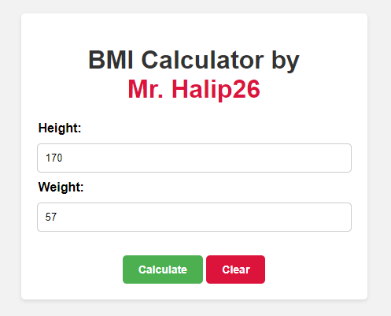

# Simple BMI Calculator Website

A basic BMI (Body Mass Index) calculator implemented in HTML, CSS, and JavaScript.

## Overview

This BMI calculator allows users to input their height (in centimeters) and weight (in kilograms) and calculates their BMI. It also provides a category indicating whether the user is underweight, normal weight, overweight, or obese.

## Features

- Input fields for height and weight
- Calculate button to compute BMI
- Clear button to reset input fields
- Display of BMI result and category

## Usage

1. Clone this repository or download the ZIP file.
2. Open `index.html` in your web browser.
3. Enter your height and weight.
4. Click the "Calculate" button to see your BMI.
5. Use the "Clear" button to reset the input fields.

## Screenshots

## License

This project is licensed under the [MIT License](LICENSE). Feel free to use, modify, and distribute it as needed.

## Acknowledgments

- BMI formula: Weight (kg) / (Height (m) * Height (m))
- BMI categories:
  - Underweight: BMI < 18.5
  - Normal weight: 18.5 ≤ BMI < 25
  - Overweight: 25 ≤ BMI < 30
  - Obese: BMI ≥ 30

---
